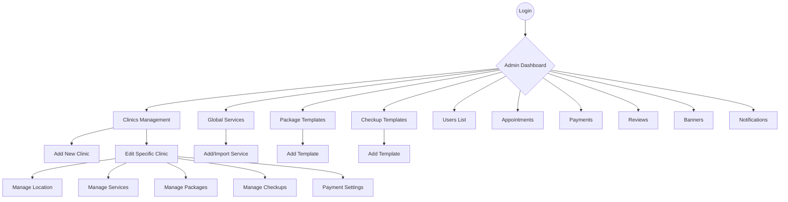

# Medical Booking Admin System - Comprehensive Functional Specification

## 1. System Overview
The Medical Booking Admin System is a centralized platform for managing a multi-clinic healthcare ecosystem. It connects administrators, clinics, doctors, and patients through a unified interface that handles appointments, payments, service catalogs, and marketing communications.

---

## 2. System Flowchart
The following diagram illustrates the navigational structure and functional hierarchy of the system:

---

## 3. Detailed Data Input Requirements

### A. Clinics (Facilities)
**Purpose:** Manage physical medical centers, their specific offerings, and financial configurations.

#### 1. Create/Edit Clinic
| Input Field | Type | Description |
| :--- | :--- | :--- |
| **Name** | Text | Official name of the clinic (e.g., "Shifo Nur"). |
| **Description** | Textarea | Detailed information about facilities and doctors. |
| **Opened At** | Time Picker | Opening time (e.g., 08:00). |
| **Closed At** | Time Picker | Closing time (e.g., 18:00). |
| **Coming Soon** | Switch | Toggle to hide clinic from public view until ready. |
| **Location Image** | File Upload | Photo of the building/entrance. |
| **Address Text** | Textarea | Full physical address. |
| **Map Link** | URL | Link to Yandex/Google Maps. |

#### 2. Payment Settings (Per Clinic)
| Input Field | Type | Description |
| :--- | :--- | :--- |
| **Provider** | Toggle | Payme or Alifpay. |
| **Active** | Switch | Enable/Disable specific provider. |
| **Merchant ID** | Text | Provider-issued ID. |
| **Login/Token** | Text | API Login or Token. |
| **Password/Key** | Text | API Password or Secret Key. |
| **Checkout URL** | URL | Payment gateway endpoint. |

#### 3. Clinic-Specific Offerings
*   **Services:** Select from Global List -> Set Custom Price (UZS).
*   **Packages:** Select Template -> Set Price (UZS) -> Set Discount (%).
*   **Checkups:** Select Template -> Set Price (UZS).

---

### B. Global Services & Templates
**Purpose:** Maintain a standardized catalog of all medical procedures to ensure consistency across clinics.

#### 1. Global Services
| Input Field | Type | Description |
| :--- | :--- | :--- |
| **Name** | Text | Service name (e.g., "MRI Scan"). |
| **Description** | Textarea | Details about the procedure. |
| **Parent Service** | Dropdown | Category for hierarchy (e.g., "Radiology"). |
| **Import File** | File | CSV/Excel for bulk upload. |

#### 2. Package Templates
| Input Field | Type | Description |
| :--- | :--- | :--- |
| **Name** | Text | Bundle name (e.g., "Cardio Health"). |
| **Description** | Textarea | What's included in the bundle. |
| **Category** | Dropdown | "Diagnosis" or "Operation". |

#### 3. Checkup Templates
| Input Field | Type | Description |
| :--- | :--- | :--- |
| **Name** | Text | Checkup name (e.g., "Women's 40+"). |
| **Description** | Textarea | Details of tests included. |
| **Category** | Dropdown | Medical category. |

---

### C. Marketing & Communications
**Purpose:** Engage users through app banners and direct notifications.

#### 1. Banners
| Input Field | Type | Description |
| :--- | :--- | :--- |
| **Title** | Text | Promotional header (e.g., "Winter Sale"). |
| **Image** | File Upload | Visual banner for the app home screen. |
| **Start Date** | Date Picker | Campaign start. |
| **End Date** | Date Picker | Campaign auto-expiry. |
| **Priority** | Number | 1 = Top of the list. |
| **Redirect URL** | URL | Where the user goes when clicking. |
| **Review Status** | Toggle | Active/Inactive. |

#### 2. Notifications
| Input Field | Type | Description |
| :--- | :--- | :--- |
| **Title** | Text | Push notification header. |
| **Message** | Textarea | Body text of the alert. |
| **Type** | Dropdown | "Admin Message", "System Alert". |
| **Priority** | Dropdown | High/Normal/Low. |
| **Recipient** | Radio | "Broadcast" (All) or "Specific Users". |
| **Send Telegram** | Switch | Also send to user's Telegram bot. |
| **Schedule** | Date/Time | Optional future send time. |

---

### D. Operational Monitoring
**Purpose:** Read-only views for tracking business performance.

#### 1. Appointments
*   **Data Points:** Service Name, Patient Name, Date/Time, Status (Pending/Confirmed), Payment Status (Paid/Unpaid).
*   **Actions:** View Details, Cancel Appointment.

#### 2. Payments
*   **Data Points:** Transaction ID, Amount, Method (Payme/Alif/Cash), Status (Success/Fail), Timestamp.

#### 3. Users (CRM)
*   **Data Points:** Full Name, Phone Number, Telegram Username, Avatar, Last Purchase Date, Total Purchase Count.

#### 4. Reviews
*   **Data Points:** User Rating (1-5 Stars), Comment text, Related Clinic/Service.
*   **Actions:** Approve/Hide review.
